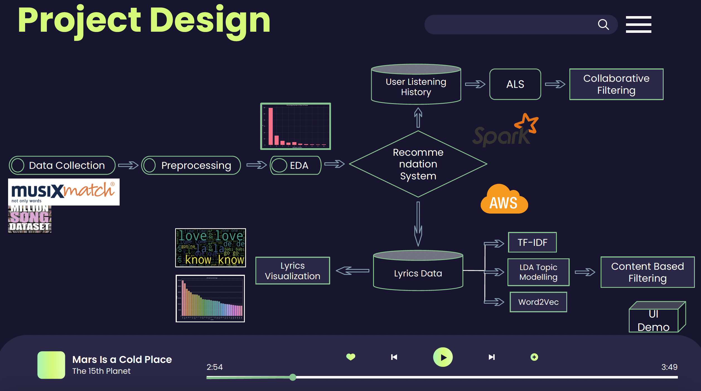
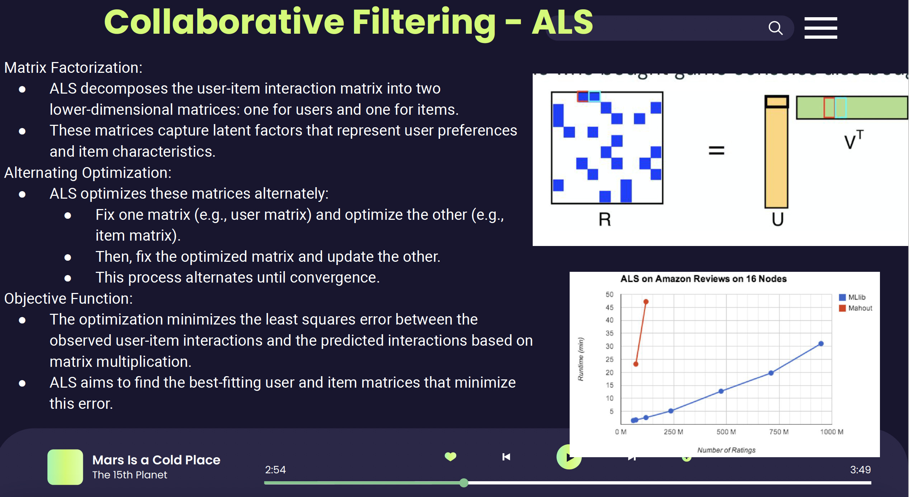
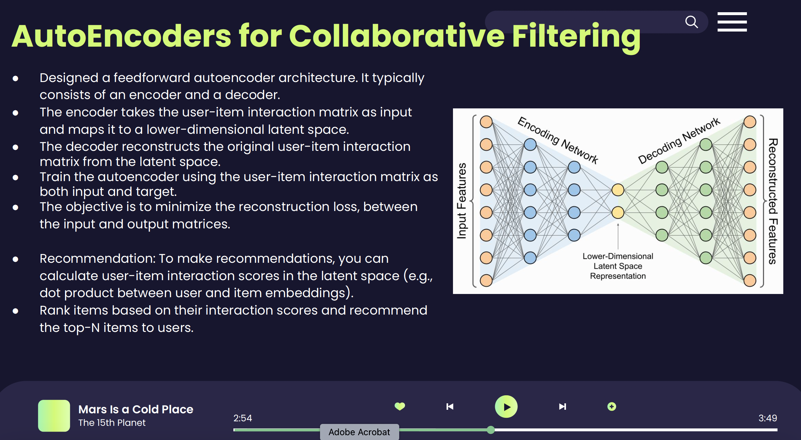
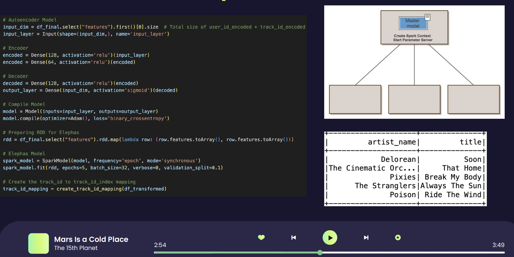
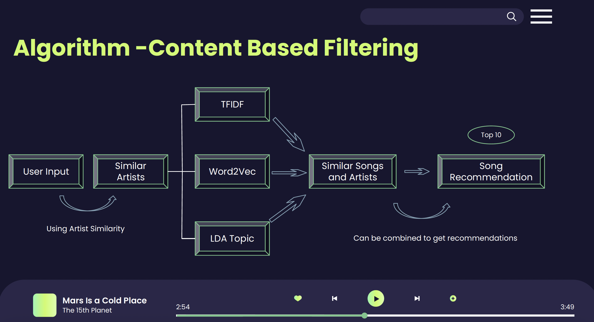
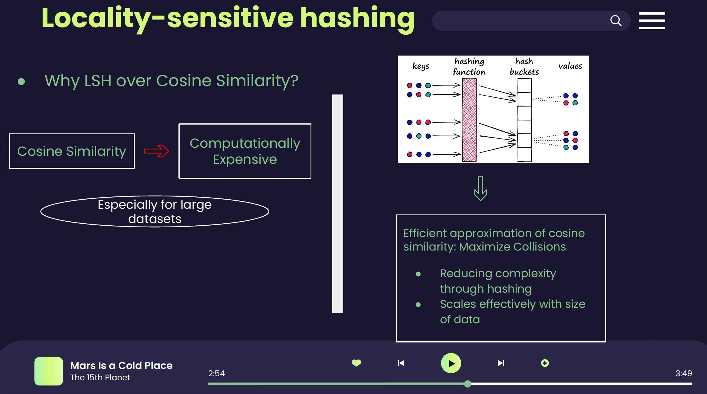
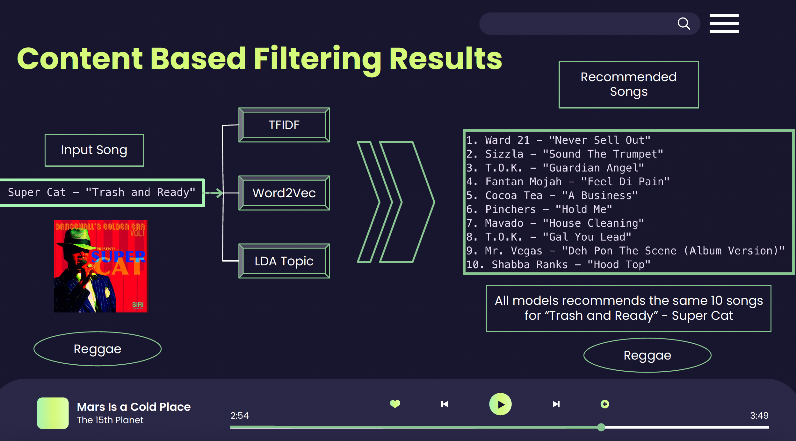
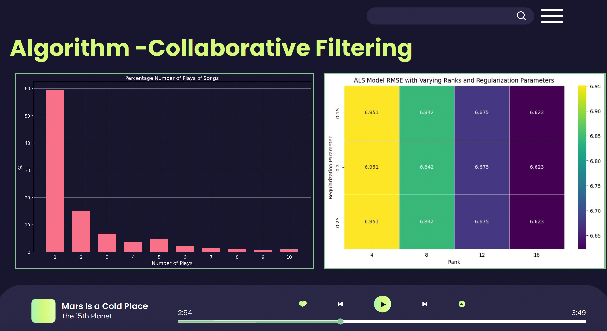

# Advanced Music Recommendation System

This repository is dedicated to the Music Recommendation System project, a comprehensive system designed for personalized music recommendation. It incorporates state-of-the-art algorithms and large-scale data processing to address the intricate challenges of music recommendation in the era of digital streaming.

## Introduction

With the evolution of the music industry from physical CDs to cloud-based streaming services like Spotify, the need for sophisticated song recommendation systems has become paramount. This project aims to enhance user experience and retention by providing personalized content, addressing the 'cold start' problem, and handling the complexity of determining song similarity.

## Project Overview

- **Goal:** To build a comprehensive system for music recommendation.
- **Methods:** Utilizing Matrix Factorization Algorithm - ALS, along with Content-based Filtering methods like TFIDF, LDA, and Word2Vec.
- **Tools:** Developed using Python, PySpark, Amazon EMR, S3, and Streamlit.
- **Project Design:**
    

## Dataset Utilization

- **Primary Dataset:** Million Song Dataset (MSD) and Musixmatch for lyrics, encompassing a diverse range of genres, artists, and song metadata.
- **User Data:** Echo Nest's `Train_triplets.txt` containing user song play count triplets.
- **Data Handling:** The project involved data consolidation, metadata extraction, table joins, and creation of datasets for model training.

## Project Design and Methodology

- **Collaborative Filtering:**     
  - **ALS:** Using ALS to analyze user listening history and preferences, forming the foundation of the 
  recommendation system. Used ALS algorithm provided by Pyspark
    

  - **Neural Collaborative Filtering:** Designed a feedforward autoencoder architecture to map user-item interactions to a lower-dimensional latent space, reconstructing the original matrix for effective song recommendations. Leveraged Elephas Framework for distributed Neural Network on Pyspark
    
    

- **Content-Based Filtering:**
  - **TF-IDF:** Highlighting unique song characteristics by emphasizing distinctive lyrics or metadata.
  - **Word2Vec:** Creating vector representations of songs to capture semantic relationships and recommend songs based on similarity.
  - **LDA Topic Modeling:** Identifying thematic patterns in songs, adding a nuanced layer to the recommendation system.
    

 - **Distance Metric:** Locality Sensitive Hashing was used instead of Cosine Similiarity for measuring simliarity on Pyspark
    

## Results and Observations

- **Recommendation Strategy:** Calculating user-item interaction scores in the latent space to rank and recommend top-N items to users.
    
    

- **Evaluation:** The absence of ground truth labels posed a challenge in objectively assessing the system's effectiveness, underscoring the need for a method to acquire such labels, perhaps through user feedback.

## Conclusion and Future Directions

The project successfully combined collaborative and content-based filtering methods to create an advanced music recommendation system. Each method brought unique strengths, with the ALS model establishing a collaborative filtering technique that can be used in hybrid with content-based filtering. Future work includes integrating user feedback, refining models with detailed user interaction data, and potentially developing a comprehensive app for song recommendations based on various inputs. The project highlighted the potential of using cloud computing services and advanced machine learning techniques in the realm of music recommendation.